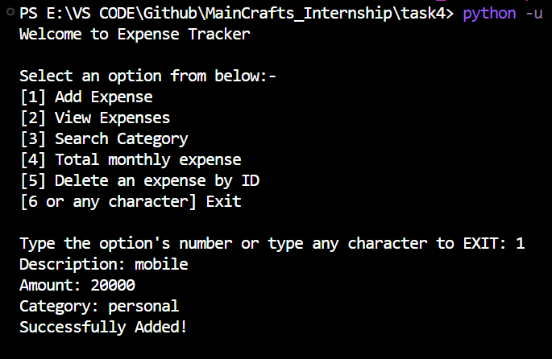
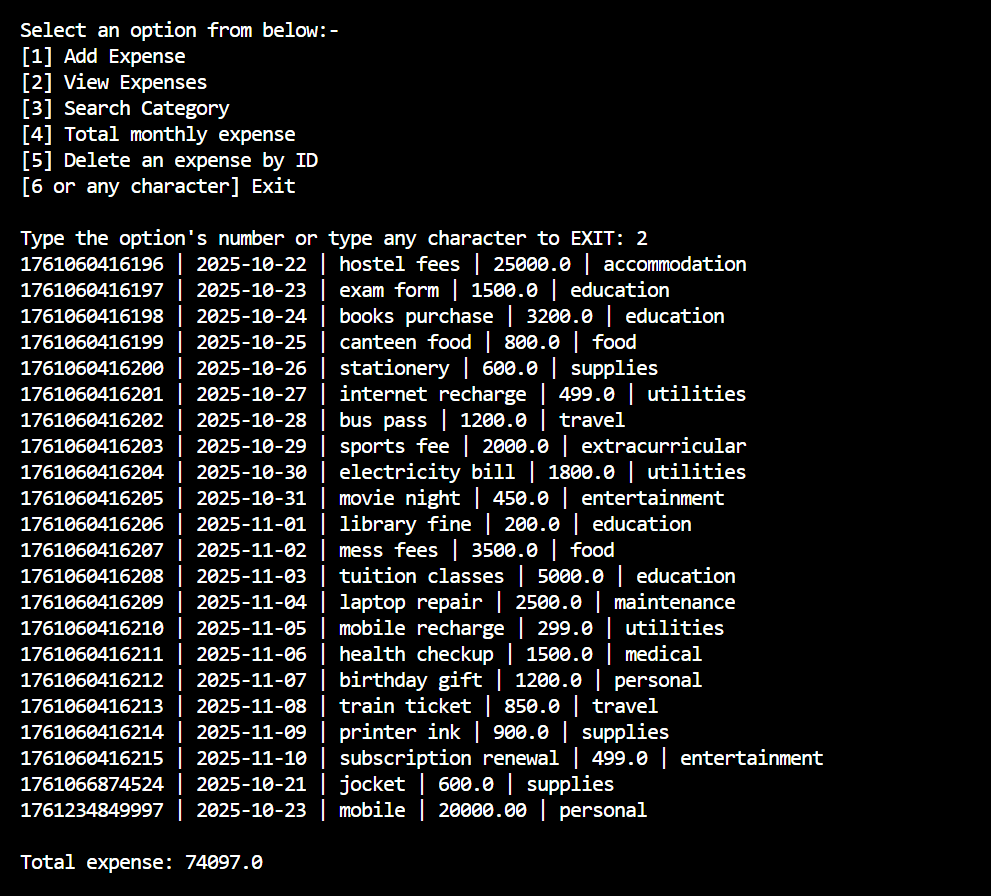
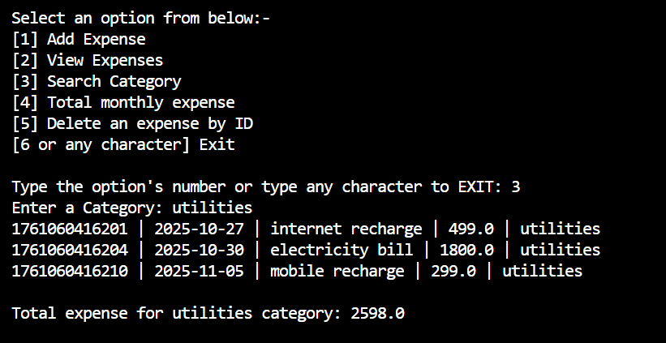
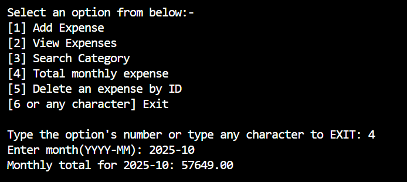
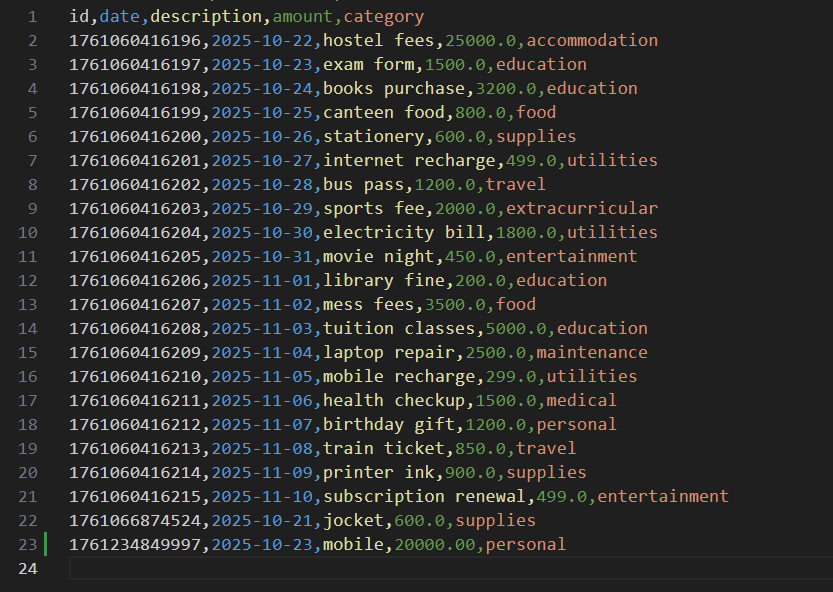
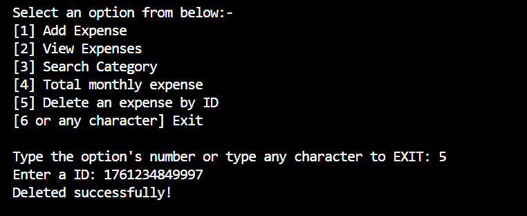
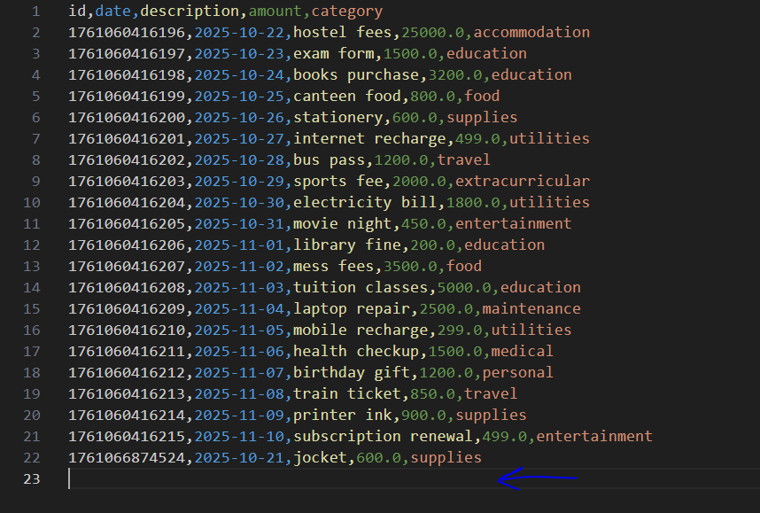

# Expense Tracker — Python CLI App
## 🧩 Description

A simple command-line expense tracker that stores and manages expenses using a CSV file.

## ⚙️ How to Run

1. Save expense_tracker.py and expenses.csv in the same folder.

2. Open a terminal in that folder.

3. Run:

``` 
    python expense_tracker.py 
```

## Menu Options

| Option | Action                          |
| :----: | :------------------------------ |
|    1   | Add new expense                 |
|    2   | View all expenses               |
|    3   | Search expenses by category     |
|    4   | View total expenses for a month |
|    5   | Delete an expense by ID         |
|    6   | Exit                            |

### Example CSV Header

``` id,date,description,amount,category ```

### Screen Shots of each functions 

1. ``` Add new expense ```



2. ``` View all expenses ```



3. ``` Search expenses by category   ```



4. ``` View total expenses for a month ```



5. ``` Delete an expense by ID ```

Before using delete function

 

Using delete function

   

After using delete function




And use 6 or and other character for EXIT 